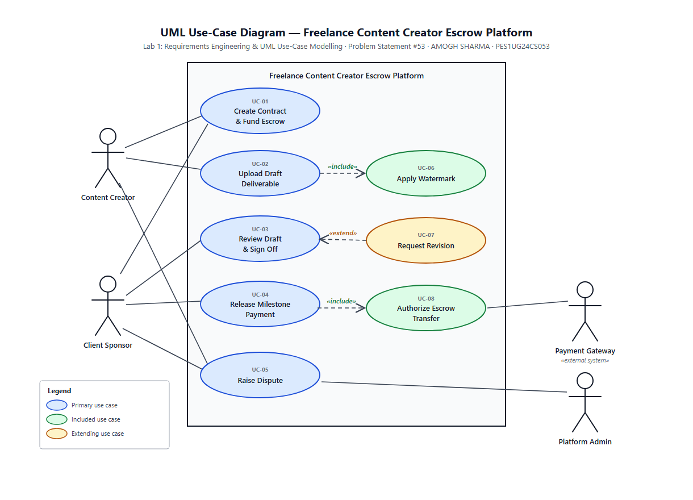

# SE Lab — PES1UG24CS053

Software Engineering Lab submissions.
**PES University, Department of CSE — Semester 5**

| | |
| --- | --- |
| **Name** | AMOGH SHARMA |
| **SRN** | PES1UG24CS053 |
| **Course** | Software Engineering (Lab) |

---

## Lab 1 — Requirements Engineering & UML Use-Case Modelling

**Problem Statement #53 — Freelance Content Creator Escrow Platform**
*(Media, Events & Community)*

A freelance contract management system that lets creators and sponsors define deliverable
milestones, review watermarked draft assets, and trigger secure milestone payment releases.

### Deliverables

| # | Deliverable | Files |
| --- | --- | --- |
| 1 | **Requirements Table** — 5 FRs + 2 NFRs with ID, Type, Description, Priority, Acceptance Criteria and Rationale | [`Lab-1/docs/1_Requirements_Table.pdf`](Lab-1/docs/1_Requirements_Table.pdf) · [markdown](Lab-1/docs/1_Requirements_Table.md) |
| 2 | **UML Use-Case Diagram** — all actors, 8 use cases, two «include» and one «extend» relationship | [`Lab-1/diagram/UseCase_Diagram.pdf`](Lab-1/diagram/UseCase_Diagram.pdf) · [`.drawio`](Lab-1/diagram/UseCase_Diagram.drawio) · [`.svg`](Lab-1/diagram/UseCase_Diagram.svg) |
| 3 | **Use-Case Flow Specification** — UC-04 with preconditions, postconditions, main success scenario and two alternate flows | [`Lab-1/docs/3_UseCase_Flow.pdf`](Lab-1/docs/3_UseCase_Flow.pdf) · [markdown](Lab-1/docs/3_UseCase_Flow.md) |

### Use-Case Diagram



### Actors

| Actor | Role |
| --- | --- |
| **Content Creator** | Creates contracts, uploads draft deliverables, raises disputes |
| **Client Sponsor** | Funds escrow, reviews drafts, signs off and releases milestone payments |
| **Payment Gateway** | External system that authorises the escrow-to-creator transfer |
| **Platform Admin** | Resolves disputes and reviews failed releases |

### Use Cases

| ID | Use Case | Relationship |
| --- | --- | --- |
| UC-01 | Create Contract & Fund Escrow | — |
| UC-02 | Upload Draft Deliverable | «include» UC-06 |
| UC-03 | Review Draft & Sign Off | extended by UC-07 |
| UC-04 | Release Milestone Payment | «include» UC-08 |
| UC-05 | Raise Dispute | — |
| UC-06 | Apply Watermark | included by UC-02 |
| UC-07 | Request Revision | «extend» UC-03 |
| UC-08 | Authorize Escrow Transfer | included by UC-04 |

### Requirements at a Glance

| Req ID | Type | Priority | Summary |
| --- | --- | --- | --- |
| FR-001 | Functional | High | Submit draft for review; release locked milestone payment only on sponsor sign-off |
| FR-002 | Functional | High | Create contract with milestones; escrow must be fully funded before it goes `ACTIVE` |
| FR-003 | Functional | High | Serve drafts as watermarked previews; block original download until `PAID` |
| FR-004 | Functional | Medium | Reject a draft with a written reason; keep full version history |
| FR-005 | Functional | Medium | Raise a dispute; freeze escrowed funds and notify a Platform Admin |
| NFR-001 | Non-functional (Performance & Security) | High | Watermarking completes and preview is ready in under 5 seconds |
| NFR-002 | Non-functional (Security & Auditability) | High | TLS 1.3 / AES-256 encryption with an append-only escrow audit log |

---

## Repository Structure

```
.
├── README.md
└── Lab-1/
    ├── docs/
    │   ├── 1_Requirements_Table.md / .pdf     # Deliverable 1
    │   └── 3_UseCase_Flow.md / .pdf           # Deliverable 3
    ├── diagram/
    │   ├── UseCase_Diagram.drawio             # editable draw.io source
    │   ├── UseCase_Diagram.svg
    │   ├── UseCase_Diagram.png
    │   └── UseCase_Diagram.pdf                # Deliverable 2
    └── problem-statement/
        ├── Problem_Statement_53.pdf
        └── Lab1_RE_Student_Handout.pdf
```

---

*Submitted by AMOGH SHARMA (PES1UG24CS053).*
